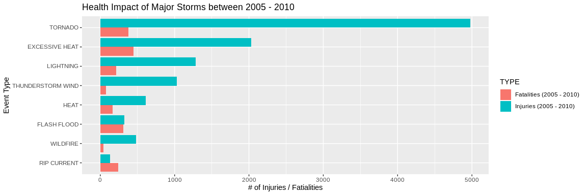
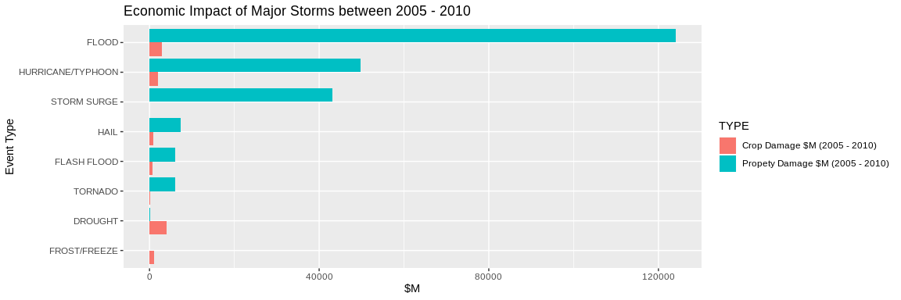

## Executive Summary

This project involves exploring the U.S. National Oceanic and Atmospheric Administration's (NOAA) storm database. This database tracks characteristics of major storms and weather events in the United States, including when and where they occur, as well as estimates of any fatalities, injuries, and property damage.  

The data analysis addresses the following questions:

1. Across the United States, which types of events (as indicated in the **EVTYPE** variable) are most harmful with respect to population health?
    - The analysis will demonstrate that the following Events have the largest impact on population health  
        1. EXCESSIVE HEAT
        2. TORNADO
        3. FLASH FLOOD
        4. RIP CURRENT
        5. LIGHTNING
        6. HEAT
        7. THUNDERSTORM WIND
        8. WILDFIRE
        
2. Across the United States, which types of events have the greatest economic consequences?
    - The analysis will demonstrate that the following Events have the greatest economic consequences  
        1. FLOOD
        2. HURRICANE/TYPHOON
        3. STORM SURGE
        4. HAIL
        5. FLASH FLOOD
        6. TORNADO
        7. DROUGHT
        8. FROST/FREEZE

## Data Processing
- Load necessary packages

```r
library(tidyverse)
library(lubridate)
```

- Download data and load csv.bz2 file.
- Since the dataset is large and more recent data is more complete we will only load a subset of data to do this analysis.


```r
data_url <- "https://d396qusza40orc.cloudfront.net/repdata%2Fdata%2FStormData.csv.bz2"
dataName <- "data/storm.csv.bz2"
if(!dir.exists("data")){dir.create("data")}


if(!file.exists(dataName)){
    download.file(data_url, dataName)
    #no need to unzip
  }
storm_headers <- names(read.csv(dataName, nrows = 2))
storm <- read.csv(dataName, header=FALSE, skip =500000)
names(storm) <- storm_headers
```

Following scripts will clean, filter and normalize the data  
1. Convert dates from factor to dates.  
- Assume the years 2005 - 2010 are representative for the analysis  
- Since 2011 is not a complete year remove 2011  
  

```r
storm$BGN_DATE <- mdy_hms(storm$BGN_DATE)
storm$END_DATE <- mdy_hms(storm$END_DATE)

#filter to only show values between 2005 and 2010
storm <- filter(storm, BGN_DATE >= "2005-01-01", BGN_DATE < "2011-01-01")
```

2. Normalize Property Damage and Crop Damage to millions by creating new variables


```r
exp_key = data.frame( key = c("K", "M", "B", "0", ""), value = c(1000, 1000000, 1000000000, 10, 0))

storm$PROPDMG_USD_M = storm %>%
  select(PROPDMGEXP, PROPDMG) %>%
  left_join(exp_key , by = c("PROPDMGEXP" = "key")) %>%
  mutate(PROPDMG_USD_M = PROPDMG * value / 1000000) %>%
  pull()

storm$CROPDMG_USD_M = storm %>%
  select(CROPDMGEXP, CROPDMG) %>%
  left_join(exp_key , by= c("CROPDMGEXP"="key")) %>%
  mutate(CROPDMG_USD_M = CROPDMG * value / 1000000) %>%
  pull()
```

```
## Warning: Column `CROPDMGEXP`/`key` joining factors with different levels,
## coercing to character vector
```


## Results
- Summarize the years of data beween 2005 - 2010 for each Event Type to determine total injuries, fatalities, property damage and crop damage

```r
storm_impact = storm %>% 
  group_by(EVTYPE) %>% 
  summarize(inj = sum(INJURIES),
            fat = sum(FATALITIES),
            prop=sum(PROPDMG_USD_M),
            crop = sum(CROPDMG_USD_M))
storm_impact %>% arrange(desc(fat))
```

```
## # A tibble: 57 x 5
##    EVTYPE                    inj   fat       prop     crop
##    <fct>                   <dbl> <dbl>      <dbl>    <dbl>
##  1 EXCESSIVE HEAT           2033   446      3.26   492.   
##  2 TORNADO                  4977   381   5992.     162.   
##  3 FLASH FLOOD               326   312   6087.     684.   
##  4 RIP CURRENT               133   239      0.001    0    
##  5 LIGHTNING                1283   216    372.       1.06 
##  6 HEAT                      611   166      1.52     0.176
##  7 FLOOD                     182   137 123992.    2895.   
##  8 AVALANCHE                  70    96      2.53     0    
##  9 EXTREME COLD/WIND CHILL     7    81      1.13     0    
## 10 THUNDERSTORM WIND        1027    76   3001.     258.   
## # … with 47 more rows
```

#### Types of events that are most harmful to population health:
*Event Types that are in top 90th percentiles for either Injuries or Fatalities between 2005 - 2010*

```r
health_impact <- storm_impact %>%
      select(EVTYPE, fat, inj) %>%
      filter(fat > quantile(fat, .9) | inj > quantile(inj, .9)) %>%
      arrange(desc(fat)) %>%
      rename("Fatalities (2005 - 2010)" = fat ,
             "Injuries (2005 - 2010)" = inj )
    health_impact
```

```
## # A tibble: 8 x 3
##   EVTYPE            `Fatalities (2005 - 2010)` `Injuries (2005 - 2010)`
##   <fct>                                  <dbl>                    <dbl>
## 1 EXCESSIVE HEAT                           446                     2033
## 2 TORNADO                                  381                     4977
## 3 FLASH FLOOD                              312                      326
## 4 RIP CURRENT                              239                      133
## 5 LIGHTNING                                216                     1283
## 6 HEAT                                     166                      611
## 7 THUNDERSTORM WIND                         76                     1027
## 8 WILDFIRE                                  45                      483
```

##### The following figure displays the most devasting weather events for health sorted by Injuries:


```r
health_impact_long <- gather(health_impact, "TYPE", "VALUE", -EVTYPE)
ggplot(health_impact_long, aes(reorder(EVTYPE, VALUE), VALUE, fill=TYPE)) +
  geom_col(position="dodge") +
  coord_flip() +
  labs(title = "Health Impact of Major Storms between 2005 - 2010",
        y = "# of Injuries / Fatialities",
        x = "Event Type"
        )
```

<!-- -->


#### Types of events that have the greatest economic consequences:
Event Types that are in top 90th percentiles for either Property or Crop damage between 2005 - 2010  


```r
economic_impact <- storm_impact %>%
      select(EVTYPE, prop, crop) %>%
      filter(prop > quantile(prop, .9) | crop > quantile(crop, .9)) %>%
      arrange(desc(prop)) %>%
      rename("Propety Damage $M (2005 - 2010)" = prop ,
             "Crop Damage $M (2005 - 2010)" = crop )
    economic_impact
```

```
## # A tibble: 8 x 3
##   EVTYPE          `Propety Damage $M (2005 - 2… `Crop Damage $M (2005 - 20…
##   <fct>                                   <dbl>                       <dbl>
## 1 FLOOD                               123992.                         2895.
## 2 HURRICANE/TYPH…                      49787.                         2013.
## 3 STORM SURGE                          43059.                            0 
## 4 HAIL                                  7429.                          976.
## 5 FLASH FLOOD                           6087.                          684.
## 6 TORNADO                               5992.                          162.
## 7 DROUGHT                                201.                         4081.
## 8 FROST/FREEZE                             5.44                       1070.
```

**The following figure displays the most economically impactful weather events sorted by property damage:**


```r
economic_impact_long <- gather(economic_impact, "TYPE", "VALUE", -EVTYPE)
ggplot(economic_impact_long, aes(reorder(EVTYPE, VALUE), VALUE, fill=TYPE)) +
  geom_col(position="dodge") +
  coord_flip() +
  labs(title = "Economic Impact of Major Storms between 2005 - 2010",
        y = "$M",
        x = "Event Type"
        )
```

<!-- -->

**Better predictions of the aforementioned weather events will lead to saving lives and the livlihood of people within the United States**
